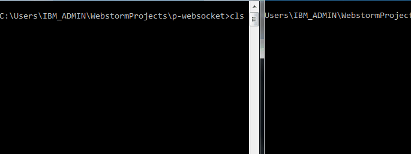

##socket是什么
socket一套基于TCP/IP协议的封装的**接口**，**它不是协议**。

各种语言基本上都有自己的socket API实现，但其[API列表](http://en.wikipedia.org/wiki/Berkeley_sockets#Socket_API_functions)都大同小异。


下面以nodejs为例来实践一下socket编程。
- `server`

```javascript
    require('net').createServer(function(sock){
        console.log('CONNECTED: ' + sock.remoteAddress +':'+ sock.remotePort);

        sock.on('data', function(data) {
            console.log('DATA ' + sock.remoteAddress + ': ' + data);
            sock.write('Client said "' + data + '"');
        });
        sock.on('close', function(data) {
            console.log('CLOSED');
        });
    }).listen(8888, function(){
        console.log('Server listening ...');
    });

```

- `client`

```javascript
    var net = require('net');

    var client = new require('net').Socket();
    client.connect(8888, function() {
        console.log('CONNECTED');
        client.write('Hello Server!');
    });

    client.on('data', function(data) {
        console.log('DATA: ' + data);
    });

    client.on('close', function() {
        console.log('Connection closed');
    });

    process.stdin.setEncoding('utf8');
    process.stdin.on('data', function(data){
        client.write(data);
    });
```
- works



##web socket
difference between Cometed,

####参考链接
- [Berkeley sockets](http://en.wikipedia.org/wiki/Berkeley_sockets)
- http://socket.io/
- http://jingyan.baidu.com/article/08b6a591e07ecc14a80922f1.html
- http://goodcandle.cnblogs.com/archive/2005/12/10/294652.aspx